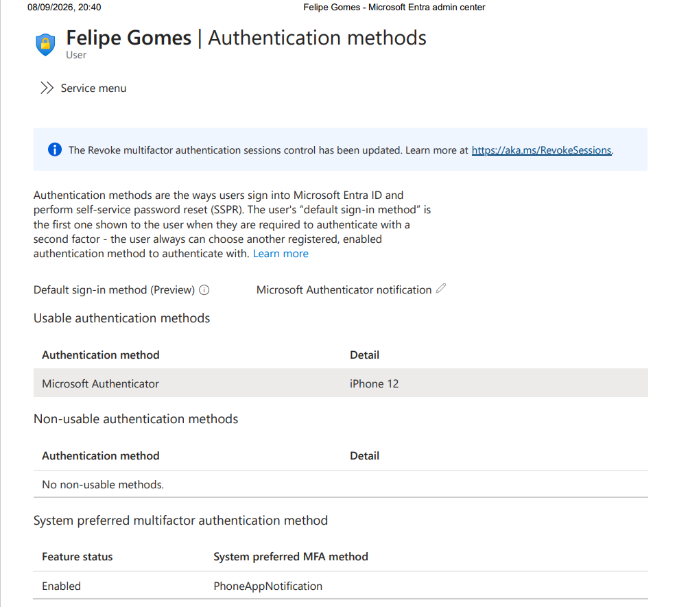

# EV-IAM-007-01 — Método de autenticação atual

- Identidade: EMP0006 — Felipe Gomes
- Fonte: Microsoft Entra → Usuários → Métodos de autenticação
- Data da consulta: 2026-09-08

## Resultado

Microsoft Authenticator exibido como método utilizável,
associado ao dispositivo identificado como “iPhone 12”.
Notificação do aplicativo exibida como método padrão.

## Limitação

A captura comprova o estado observado na consulta,
mas não a data original do cadastro nem o uso em um login.
